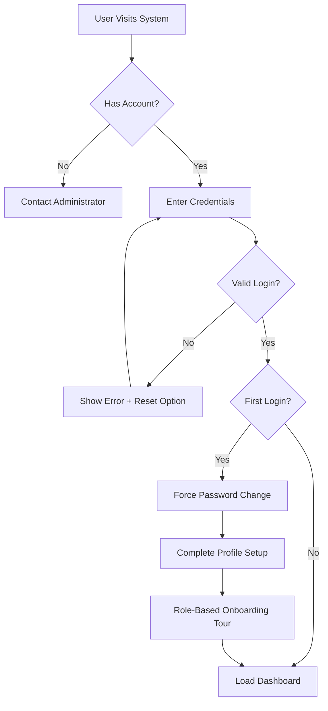
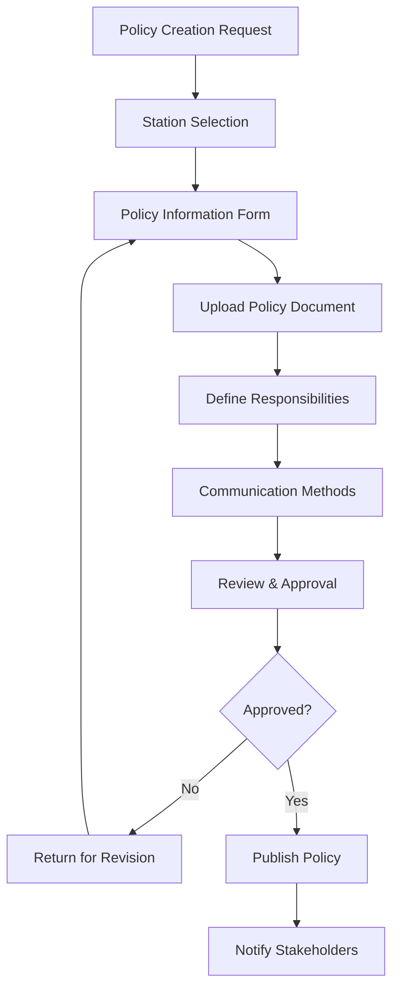
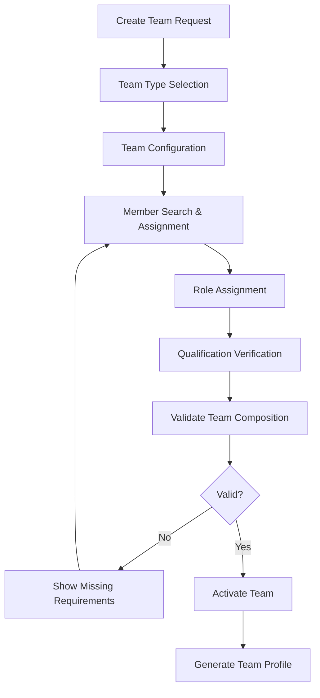
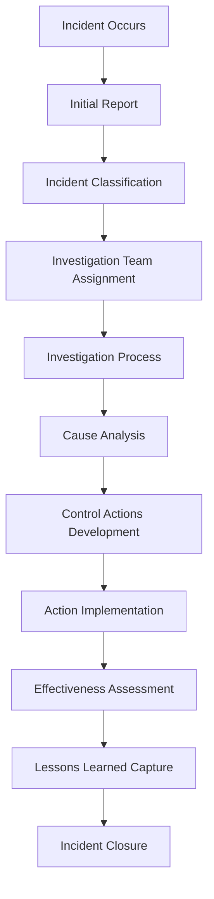
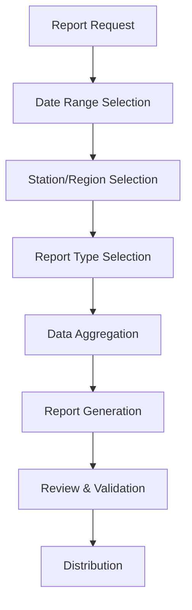

# KTDA OSHA System Application Flow Document

**Document Version:** 1.0
**Date:** September 23, 2025
**Project:** KTDA Occupational Safety & Health Management System

---

## Table of Contents
1. [Overview](#overview)
2. [User Personas & Roles](#user-personas--roles)
3. [Authentication & Onboarding Flow](#authentication--onboarding-flow)
4. [Core User Journeys](#core-user-journeys)
5. [Module-Specific Workflows](#module-specific-workflows)
6. [Cross-Module Integration Flows](#cross-module-integration-flows)
7. [Administrative Workflows](#administrative-workflows)
8. [Reporting & Analytics Flows](#reporting--analytics-flows)
9. [Web Interface Optimization](#web-interface-optimization)
10. [Error Handling & Recovery](#error-handling--recovery)

---

## Overview

### Application Flow Philosophy
The KTDA OSHA System is designed around **role-based workflows** that guide users through their specific responsibilities while maintaining **cross-functional visibility** for safety management. The system emphasizes:

- **Progressive Disclosure**: Show relevant information based on user role and context
- **Guided Workflows**: Step-by-step processes for complex safety procedures
- **Contextual Navigation**: Smart navigation based on user's current tasks and permissions
- **Compliance-Driven Design**: Workflows ensure regulatory requirements are met


### Key Design Principles
1. **Role-Based Experience**: Each user sees only relevant functionality
2. **Task-Oriented Navigation**: Users can quickly access their pending tasks
3. **Compliance Enforcement**: System prevents non-compliant actions
4. **Audit Trail Integration**: All actions automatically logged
5. **Offline Capability**: Critical functions work without internet connection


---

## User Personas & Roles

### **1. System Administrator**
**Primary Goals**: System management, user administration, data integrity
**Key Responsibilities**:
- User management and role assignment
- System configuration and monitoring
- Data backup and integration oversight
- Performance monitoring and optimization

### **2. Regional Manager**
**Primary Goals**: Multi-station oversight, compliance monitoring, resource allocation
**Key Responsibilities**:
- Regional safety performance monitoring
- Cross-station compliance oversight
- Resource allocation and team coordination
- Regional safety trend analysis

### **3. Factory Manager (Station Manager)**
**Primary Goals**: Station compliance, team management, incident oversight
**Key Responsibilities**:
- Complete station OSH compliance
- Team formation and management
- Policy implementation and review
- Incident investigation oversight

### **4. OSH Officer/Safety Officer**
**Primary Goals**: Safety program implementation, compliance tracking, training coordination
**Key Responsibilities**:
- Risk assessment coordination
- Safety training program management
- Compliance documentation and reporting
- Incident investigation participation

### **5. Department Head**
**Primary Goals**: Department safety, team coordination, action implementation
**Key Responsibilities**:
- Department-specific safety management
- Team member assignment and coordination
- Action item implementation and tracking
- Department incident response

### **6. OSH Committee Member**
**Primary Goals**: Committee participation, issue identification, recommendation development
**Key Responsibilities**:
- Committee meeting participation
- Safety issue identification and reporting
- Recommendation development and review
- Section representation and communication

### **7. General Employee**
**Primary Goals**: Incident reporting, task completion, safety compliance
**Key Responsibilities**:
- Incident and near-miss reporting
- Assigned task completion
- Safety training participation
- Policy acknowledgment and compliance

---

## Authentication & Onboarding Flow

### **Initial System Access**



### **User Onboarding Process**

#### **Step 1: Account Creation (Admin)**
- Administrator creates user account
- System validates employee exists in legacy DB
- Auto-populates basic information
- Assigns initial role and station access
- Sends welcome email with temporary credentials

#### **Step 2: First Login Experience**
- User forced to change temporary password
- Profile completion (contact info, preferences)
- Role-specific welcome tour
- Introduction to key features for their role
- Assignment of initial tasks (if any)

#### **Step 3: Role-Specific Setup**
- **Factory Manager**: Station overview, team status review
- **Committee Member**: Committee assignment confirmation, meeting schedules
- **Employee**: Department assignment, reporting procedures introduction

---

## Core User Journeys

### **Journey 1: New Factory Manager Onboarding**

**Story**: *"As a new Factory Manager, I need to understand my station's OSH compliance status and set up required teams so I can ensure regulatory compliance."*

#### **Flow Steps:**
1. **Login & Welcome**
   - Initial login with temporary credentials
   - Password change and profile setup
   - Welcome tour highlighting key responsibilities

2. **Station Overview Dashboard**
   - View station compliance status (traffic light system)
   - Identify missing components (policy, committees, assessments)
   - Review employee count and organizational structure

3. **Guided Setup Process**
   - **Step 1**: OSH Policy Setup
     - Upload existing policy or create new
     - Define responsibilities for different roles
     - Set review schedules and implementation status

   - **Step 2**: OSH Committee Formation
     - Create committee team using guided wizard
     - Add members ensuring section representation
     - Assign roles (Chairman, Secretary, etc.)
     - Set meeting schedules and training requirements

   - **Step 3**: Risk Assessment Team Setup
     - Create risk assessment team
     - Assign required roles (1 Mgt, 2 Employee, 1 Outsourced, 1 Other)
     - Set assessment frequency and schedule

   - **Step 4**: Incident Investigation Team
     - Create investigation team
     - Assign qualified members
     - Define response procedures and escalation

4. **Initial Tasks Assignment**
   - System generates compliance checklist
   - Assigns priority tasks with deadlines
   - Provides resources and templates

### **Journey 2: Employee Incident Reporting**

**Story**: *"As an employee, I witnessed a near-miss incident and need to report it quickly and accurately so appropriate actions can be taken."*

#### **Flow Steps:**
1. **Incident Detection**
   - Employee recognizes incident/near-miss
   - Decides to report through system

2. **Quick Access to Reporting**
   - **Desktop**: Dashboard "Report Incident" button
   - **Desktop/Tablet**: Quick action from system dashboard
   - **Emergency**: Direct link from safety poster QR code

3. **Incident Type Classification**
   - Simple radio button selection: Near Miss / Incident
   - If incident: Severity selection (Minor/Moderate/Major)
   - System shows relevant form based on selection

4. **Basic Incident Information**
   - Date and time picker (defaults to current)
   - Location dropdown (station → section)
   - Brief description text area
   - Photo upload option (file selection from device)

5. **Person Affected Details** (if applicable)
   - Employee lookup or manual entry
   - Gender and department selection
   - Injury description
   - Medical attention required (Y/N)

6. **Immediate Actions Taken**
   - What immediate steps were taken
   - Who was notified
   - Current status of affected person/area

7. **Review and Submit**
   - Summary page for review
   - Submit confirmation
   - System assigns incident number
   - Automatic notifications sent to relevant personnel

8. **Follow-up Notifications**
   - Confirmation email/SMS to reporter
   - Investigation team assignment notification
   - Reporter included in investigation updates

### **Journey 3: OSH Committee Monthly Meeting**

**Story**: *"As an OSH Committee Chairman, I need to conduct our monthly meeting, track issues, and assign action items to ensure effective safety oversight."*

#### **Flow Steps:**
1. **Meeting Preparation**
   - System sends meeting reminders to members
   - Chairman accesses pre-meeting dashboard
   - Reviews pending issues, previous actions, and agenda items

2. **Meeting Agenda Generation**
   - System auto-generates agenda based on:
     - Pending issues from previous meetings
     - New incidents since last meeting
     - Overdue action items
     - Scheduled inspection reports
   - Chairman can add custom agenda items

3. **During Meeting - Issue Tracking**
   - Chairman logs attendance
   - Reviews each agenda item systematically
   - **New Issues Entry**:
     - Issue title and description
     - Category (Risk Assessment/Accident/OSH Data/Statutory)
     - Member who raised the issue
     - Priority level assignment

4. **Recommendation Development**
   - For each issue, committee develops recommendations
   - System tracks who proposed each recommendation
   - Implementation timeline estimation
   - Resource requirements assessment

5. **Action Item Assignment**
   - Convert recommendations to actionable tasks
   - Assign responsible persons (with lookup)
   - Set due dates and milestones
   - Define success criteria

6. **Meeting Minutes Generation**
   - System auto-generates meeting minutes structure
   - Includes attendance, issues discussed, recommendations made
   - Action items with assignments and deadlines
   - Chairman reviews and approves
   - System distributes to all members and relevant management

7. **Post-Meeting Follow-up**
   - Action items appear on assignees' dashboards
   - Progress tracking notifications
   - Reminder emails before due dates
   - Next meeting automatically scheduled

### **Journey 4: Risk Assessment Annual Process**

**Story**: *"As a Risk Assessment Team Lead, I need to conduct our annual risk assessment to identify hazards and develop mitigation plans for regulatory compliance."*

#### **Flow Steps:**
1. **Assessment Planning**
   - System identifies assessment due date
   - Team lead receives planning notifications
   - Reviews team composition and qualifications
   - Schedules assessment activities

2. **Hazard Identification Process**
   - **Section-by-Section Review**:
     - Select section (Field Service, Processing, etc.)
     - Choose hazard category (Employees/Machinery/Building/Food/Others)
     - Systematic hazard identification using guided prompts

3. **Hazard Documentation**
   - **For Each Identified Hazard**:
     - Detailed hazard description
     - Who/what is affected
     - Potential impact description
     - Circumstances when hazard occurs
     - Existing precautions documentation

4. **Risk Rating Process**
   - **Severity Assessment**: System guides through criteria
     - Minor (off duty ≤3 days)
     - Moderate (off duty >3 days)
     - Major (death/major harm)

   - **Likelihood Assessment**: System provides guidance
     - Low (rarely occurs)
     - Medium (frequently occurs)
     - High (certain/near certain)

   - **Automatic Risk Calculation**: Severity × Likelihood = Risk Rating (1-9)
   - **Priority Assignment**: System auto-assigns Low/Medium/High priority

5. **Mitigation Planning**
   - For each hazard, team develops mitigation measures
   - Implementation timeline definition
   - Responsible person assignment
   - Monitoring system specification
   - Resource requirement estimation

6. **Review and Approval Process**
   - Team lead reviews complete assessment
   - Management review and approval
   - System generates assessment report
   - Distribution to relevant stakeholders

7. **Implementation Tracking**
   - Mitigation plans become trackable action items
   - Progress monitoring dashboard
   - Overdue item notifications
   - Effectiveness assessment scheduling

---

## Module-Specific Workflows

### **1. OSH Policy Management Workflow**

#### **Policy Creation/Update Process**


#### **User Stories**:
- **Factory Manager**: "I need to create/update our station's OSH policy to ensure compliance and get management signature."
- **OSH Officer**: "I need to review policy implementation status and track communication effectiveness."
- **Employee**: "I need to access and acknowledge our updated OSH policy."

### **2. Team Management Workflow**

#### **Team Formation Process**


#### **User Stories**:
- **Factory Manager**: "I need to set up an OSH committee ensuring all sections are represented and roles are properly assigned."
- **Team Member**: "I need to view my team assignments, responsibilities, and upcoming meetings."
- **OSH Officer**: "I need to track team composition compliance across all stations."

### **3. Incident Management Workflow**

#### **Complete Incident Lifecycle**


#### **User Stories**:
- **Employee**: "I need to quickly report an incident with photos and get confirmation it was received."
- **Investigation Team Lead**: "I need to manage the investigation process, assign tasks, and track progress to completion."
- **Factory Manager**: "I need oversight of all incidents, investigation status, and action implementation."

---

## Cross-Module Integration Flows

### **1. Compliance Dashboard Integration**

#### **Daily Station Manager Flow**
```
Login → Dashboard → Compliance Overview → Priority Actions → Module Navigation
  ↓
Dashboard shows:
- Policy status (expired, pending review)
- Committee meetings (overdue, upcoming)
- Risk assessments (due, in progress)
- Incidents (new, pending investigation)
- Actions (overdue, due today)
```

### **2. Document Management Integration**

#### **Document Workflow Across Modules**
- **Policy Module**: Upload policy → System stores → Links to station
- **Committee Module**: Upload minutes → System stores → Links to committee
- **Risk Assessment**: Upload report → System stores → Links to assessment
- **Incident Module**: Upload evidence → System stores → Links to incident

### **3. Notification Integration**

#### **System-Wide Notification Flow**
```
Event Trigger → Notification Engine → Role-Based Filtering → Multi-Channel Delivery
  ↓
Channels:
- In-app notifications (real-time)
- Email notifications (formal communications)
- SMS notifications (urgent incidents)
- Dashboard alerts (task reminders)
```

---

## Administrative Workflows

### **1. System Administrator Daily Flow**

#### **Morning Routine**
1. **System Health Check**
   - Review overnight sync logs
   - Check system performance metrics
   - Monitor user activity and errors

2. **User Management Tasks**
   - Process new user requests
   - Review role change requests
   - Investigate access issues

3. **Data Management**
   - Monitor legacy DB synchronization
   - Review data quality reports
   - Handle data conflicts and errors

4. **System Maintenance**
   - Review backup status
   - Monitor integration health
   - Plan maintenance activities

### **2. Regional Manager Workflow**

#### **Weekly Oversight Process**
1. **Regional Dashboard Review**
   - Station compliance summary
   - Cross-station performance comparison
   - Regional safety trends

2. **Station Deep Dive**
   - Select underperforming stations
   - Review detailed compliance status
   - Identify resource needs

3. **Action Planning**
   - Schedule station visits
   - Assign regional resources
   - Plan cross-station knowledge sharing

---

## Reporting & Analytics Flows

### **1. Compliance Reporting Workflow**

#### **Monthly Compliance Report Generation**


### **2. Executive Dashboard Flow**

#### **Executive Weekly Review**
1. **High-Level Metrics**
   - Overall compliance percentage
   - Incident trend analysis
   - Regional performance comparison

2. **Drill-Down Capability**
   - Click station → Station details
   - Click metric → Supporting data
   - Click trend → Historical analysis

3. **Action Identification**
   - Identify problem areas
   - Generate action assignments
   - Schedule follow-up reviews

---

## Web Interface Optimization

### **1. Responsive Design Scenarios**

#### **Tablet-Optimized Field Reporting**
```
Incident Occurs → Open Web Browser → Quick Report Button → File Upload →
Location Selection → Text Notes → Submit → Confirmation
```

#### **Responsive Inspection Workflow**
```
Inspection Checklist → Section Selection → Photo Upload →
Issue Identification → Action Assignment → Digital Signature → Auto-Save
```

### **2. Offline Capability**

#### **Offline-to-Online Sync**
```
Offline Data Entry → Local Storage → Connection Detection →
Background Sync → Conflict Resolution → User Notification
```

---

## Error Handling & Recovery

### **1. Common Error Scenarios**

#### **Network Connectivity Issues**
- **Detection**: Automatic network status monitoring
- **User Feedback**: Clear offline indicators
- **Recovery**: Automatic retry with exponential backoff
- **Data Preservation**: Local storage for offline work

#### **Data Validation Errors**
- **Prevention**: Real-time form validation
- **User Guidance**: Context-specific help text
- **Recovery**: Clear error messages with correction guidance
- **Progress Preservation**: Save partial form data

#### **Permission Errors**
- **Detection**: Role-based access validation
- **User Feedback**: Clear permission requirements
- **Recovery**: Contact administrator guidance
- **Audit Trail**: Log access attempts for security

### **2. System Recovery Procedures**

#### **Database Sync Failures**
```
Sync Failure Detection → Error Logging → Administrator Notification →
Manual Intervention → Data Reconciliation → Service Restoration
```

#### **Performance Degradation**
```
Performance Monitoring → Threshold Detection → Alert Generation →
Resource Scaling → User Notification → Issue Resolution
```

---

## User Experience Enhancements

### **1. Guided Workflows**
- **First-Time User**: Step-by-step tutorials for key processes
- **Complex Tasks**: Wizard-style interfaces for multi-step processes
- **Context Help**: Inline help text and tooltips
- **Progress Indicators**: Clear indication of completion status

### **2. Personalization Features**
- **Dashboard Customization**: Role-based widget arrangement
- **Notification Preferences**: User-controlled notification settings
- **Quick Actions**: Customizable shortcuts for frequent tasks
- **Recent Items**: Easy access to recently viewed/edited items

### **3. Accessibility Features**
- **Keyboard Navigation**: Full keyboard accessibility
- **Screen Reader Support**: ARIA labels and descriptions
- **High Contrast Mode**: Enhanced visibility options
- **Responsive Optimization**: Touch-friendly interface design for tablets

---

## Integration Touchpoints

### **1. Legacy System Integration**
- **Employee Lookup**: Real-time search across legacy database
- **Organizational Structure**: Sync station/department hierarchies
- **Authentication**: Validate against existing credentials
- **Reporting**: Export to legacy reporting systems

### **2. External System Integration**
- **DOSHMIS Reporting**: Automated incident submission
- **Insurance Systems**: Claim notification and tracking
- **Email Systems**: Notification and document distribution
- **Regulatory Portals**: Compliance report submission

This comprehensive app flow document provides the foundation for understanding user interactions, system processes, and integration requirements for the KTDA OSHA System, ensuring all stakeholders have a clear view of how the system will function from a user perspective.