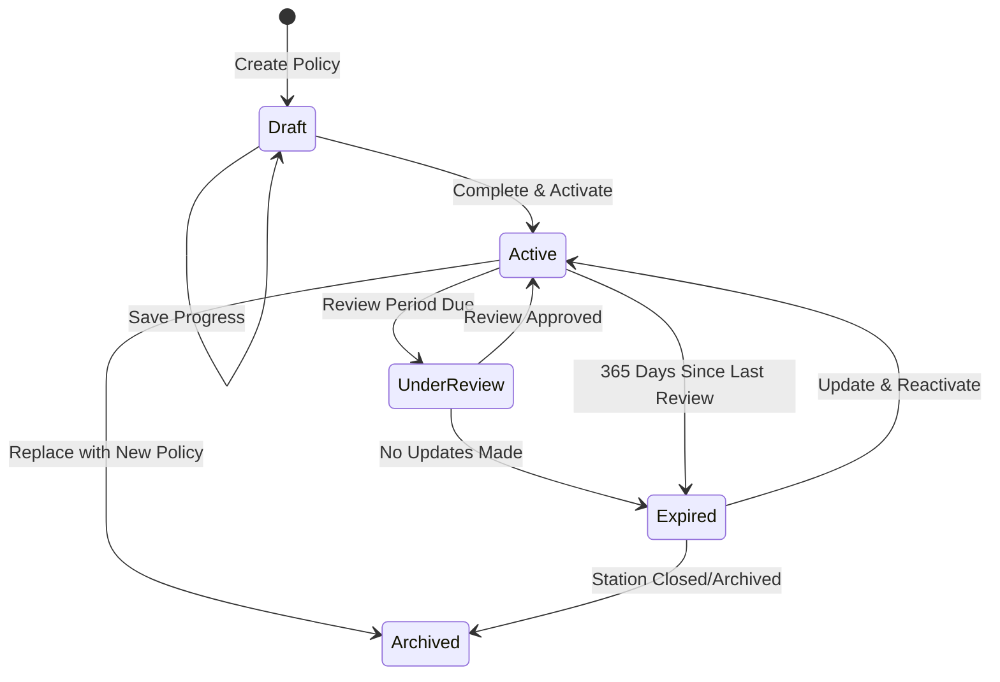

# OSH Policy Management Module - Implementation Document

**Document Version:** 2.0 (Revised)
**Date:** October 27, 2025
**Project:** KTDA Occupational Safety & Health Management System
**Phase:** Phase 4 - OSH Policy Management (Weeks 7-8)
**Module:** OSH Policy Management

---

## Table of Contents
1. [Overview](#overview)
2. [Business Requirements](#business-requirements)
3. [Existing Data Model Review](#existing-data-model-review)
4. [Application Flow](#application-flow)
5. [Components Architecture](#components-architecture)
6. [User Interface Design](#user-interface-design)
7. [Implementation Steps](#implementation-steps)
8. [Testing Strategy](#testing-strategy)
9. [Integration Points](#integration-points)

---

## Overview

### Module Purpose
The OSH Policy Management module enables stations to manage their occupational safety and health policies, track implementation status, define responsibilities, and maintain compliance with OSHA 2007 regulatory requirements.

### Key Objectives
- Provide structured policy creation and maintenance
- Track policy signatures and approval workflows
- Manage organizational responsibilities for OSH compliance
- Monitor policy implementation and communication effectiveness
- Support contractor safety charter management
- Enable policy review scheduling and tracking
- Update OrgMetadata compliance status automatically

### Regulatory Context
According to OSHA 2007, every workplace must have:
- A written OSH policy signed by top management
- Clear definition of OSH responsibilities at all organizational levels
- Evidence of policy communication to all staff
- Contractor safety requirements (if applicable)
- Regular policy review and updates

---

## Business Requirements

### Functional Requirements

#### FR1: Policy Information Management
- **FR1.1**: System shall allow creation of one OSH policy per station
- **FR1.2**: System shall capture management signature status and date
- **FR1.3**: System shall record the employee who signed the policy (by payroll number)
- **FR1.4**: System shall track last review date
- **FR1.5**: System shall track policy implementation status
- **FR1.6**: System shall track policy status (Draft, Active, UnderReview, Expired, Archived)

#### FR2: Responsibility Management
- **FR2.1**: System shall capture management OSH responsibilities
- **FR2.2**: System shall capture factory supervisor responsibilities
- **FR2.3**: System shall capture outsourced labour responsibilities
- **FR2.4**: System shall capture contractor responsibilities

#### FR3: Communication Tracking
- **FR3.1**: System shall record methods used to communicate policy to staff
- **FR3.2**: System shall support multiple communication methods description
- **FR3.3**: System shall track communication effectiveness (future enhancement)

#### FR4: Contractor Charter Management
- **FR4.1**: System shall track existence of contractor safety charter
- **FR4.2**: System shall link contractor charter documents via MediaAssociation
- **FR4.3**: System shall validate contractor charter presence when indicated

#### FR5: Document Management
- **FR5.1**: System shall support uploading OSH policy documents (PDF, Word)
- **FR5.2**: System shall support uploading contractor charter documents
- **FR5.3**: System shall link documents to policies via MediaAssociation table
- **FR5.4**: System shall support document preview and download
- **FR5.5**: System shall support document versioning through MediaFile versioning
- **FR5.6**: System shall maintain audit trail for document access via MediaAccessLog

#### FR6: Audit and Compliance
- **FR6.1**: System shall maintain creation and update timestamps
- **FR6.2**: System shall provide compliance status dashboard
- **FR6.3**: System shall highlight policies due for review
- **FR6.4**: System shall automatically update OrgMetadata.OshPolicyExists flag
- **FR6.5**: System shall update OrgMetadata.ComplianceStatus based on policy status

### Non-Functional Requirements

#### NFR1: Performance
- Policy form shall load within 2 seconds
- Document uploads shall respect MediaCollection.MaxFileSizeMb settings
- Policy dashboard shall display within 3 seconds

#### NFR2: Usability
- Form shall provide guided workflow with clear sections
- Validation errors shall be clear and actionable
- Employee lookup shall provide auto-complete functionality

#### NFR3: Security
- Access shall be restricted based on station assignments
- Document access shall be controlled via MediaCollection permissions
- All document access shall be logged in MediaAccessLog

#### NFR4: Data Integrity
- One policy per station (enforced at business logic level)
- Required fields shall be validated before save
- Date fields shall be validated for logical consistency
- Policy status transitions shall follow defined workflow

---

## Existing Data Model Review

### 1. OshPolicy Model (EXISTING)

**File:** `Models/OshPolicy.cs`

```csharp
public class OshPolicy
{
    [Key]
    public int PolicyId { get; set; }

    public int StationId { get; set; }

    public bool HasTopManagementSignature { get; set; }
    public DateTime? DateSigned { get; set; }

    [MaxLength(20)]
    public string? SignedByPayroll { get; set; }

    public DateTime? LastReviewedDate { get; set; }
    public bool IsPolicyImplemented { get; set; }

    public string? CommunicationMethods { get; set; }
    public string? ManagementResponsibilities { get; set; }
    public string? SupervisorResponsibilities { get; set; }
    public string? OutsourcedResponsibilities { get; set; }
    public string? ContractorResponsibilities { get; set; }

    public bool ContractorCharterExists { get; set; }

    [Required]
    [MaxLength(20)]
    public string PolicyStatus { get; set; } = string.Empty;

    public DateTime CreatedAt { get; set; } = DateTime.UtcNow;
    public DateTime? UpdatedAt { get; set; }

    // Navigation properties
    public Station Station { get; set; } = null!;
}
```

**Key Observations:**
- ✅ Model already exists with all required fields
- ✅ PolicyStatus field exists for workflow management
- ⚠️ No audit fields for CreatedBy/UpdatedBy (will handle in service layer via session)
- ⚠️ No SignedByEmployee navigation property (will query separately)
- ⚠️ No direct MediaFile navigation (uses MediaAssociation pattern)

**Policy Status Values:**
- `Draft` - Policy being created/edited
- `Active` - Current active policy
- `UnderReview` - Policy under review for updates
- `Expired` - Policy past review date
- `Archived` - Historical policy

### 2. Media Management Models (EXISTING)

#### MediaFile Model
**File:** `Models/MediaFile.cs`

**Key Features:**
- File versioning support (ParentMediaId, VersionNumber, IsLatestVersion)
- Comprehensive metadata (FileHash, MimeType, FileSizeBytes)
- Soft delete capability (IsActive, DeletedAt, DeletedByPayroll)
- Background processing support (ProcessingStatus)
- Audit fields (UploadedByPayroll, CreatedAt, UpdatedAt)

#### MediaCollection Model
**File:** `Models/MediaCollection.cs`

**Key Features:**
- Collection-level permissions (IsPublic, RequiresAuthentication, AllowedRoles)
- File type restrictions (AllowedFileTypes JSON array)
- Size limits (MaxFileSizeMb)
- Retention policies (RetentionPolicyDays)
- Module-scoped collections (ModuleName)

**Required Collections for OSH Policy:**
1. **"OSHPolicyDocuments"** - For policy documents
   - MaxFileSizeMb: 10
   - AllowedFileTypes: ["pdf", "doc", "docx"]
   - RequiresAuthentication: true

2. **"ContractorCharters"** - For contractor charter documents
   - MaxFileSizeMb: 10
   - AllowedFileTypes: ["pdf", "doc", "docx"]
   - RequiresAuthentication: true

#### MediaAssociation Model
**File:** `Models/MediaAssociation.cs`

**Polymorphic Association Pattern:**
```csharp
public class MediaAssociation
{
    public int MediaId { get; set; }
    public string AssociatedTable { get; set; }  // "OshPolicies"
    public string AssociatedRecordId { get; set; }  // PolicyId as string
    public string AssociationType { get; set; }  // "PolicyDocument" or "CharterDocument"
    public string? AssociationLabel { get; set; }  // Display label
    public int DisplayOrder { get; set; }
    public bool IsPrimary { get; set; }
    // ... other fields
}
```

**For OSH Policy Documents:**
- AssociatedTable: `"OshPolicies"`
- AssociatedRecordId: PolicyId (converted to string)
- AssociationType: `"PolicyDocument"` or `"CharterDocument"`
- AssociationLabel: Optional display name

#### MediaAccessLog Model
**File:** `Models/MediaAccessLog.cs`

**Automatic Audit Trail:**
- Tracks all file access (view, download, delete)
- Records user information (UserPayroll, IpAddress, UserAgent)
- Logs request status and response size

### 3. OrgMetadata Model (EXISTING)

**File:** `Models/OrgMetadata.cs`

```csharp
public class OrgMetadata
{
    [Key]
    public int MetadataId { get; set; }
    public int StationId { get; set; }

    [MaxLength(20)]
    public string? FactoryManagerPayroll { get; set; }

    public int? TotalEmployeesMale { get; set; }
    public int? TotalEmployeesFemale { get; set; }
    public int? OutsourcedEmployeesMale { get; set; }
    public int? OutsourcedEmployeesFemale { get; set; }

    public bool OshPolicyExists { get; set; }
    public string? ComplianceStatus { get; set; }

    public DateTime CreatedAt { get; set; } = DateTime.UtcNow;
    public DateTime? UpdatedAt { get; set; }

    // Navigation properties
    public Station Station { get; set; } = null!;
}
```

**Integration Requirements:**
- Update `OshPolicyExists` flag when policy is created/deleted
- Update `ComplianceStatus` based on policy status and completeness
- ComplianceStatus values: "Compliant", "PartiallyCompliant", "NonCompliant", "NotAssessed"

### 4. Station Model (EXISTING)

**File:** `Models/Station.cs`

**Key Relationships:**
- Has one OshPolicy (no explicit navigation, query by StationId)
- Has one OrgMetadata (one-to-one)
- Has one OrgCategory (many-to-one)
- Has many Teams (one-to-many)

### 5. OrgCategory Model (EXISTING)

**File:** `Models/OrgCategory.cs`

**Purpose:** Classifies stations into categories (e.g., Factory, Warehouse, Office)
- Used for filtering and reporting
- May have category-specific policy templates (future enhancement)

---

## Application Flow

### User Journey: Factory Manager Creating OSH Policy

```mermaid
graph TD
    A[Login to System] --> B[Navigate to Dashboard]
    B --> C{Policy Exists?}
    C -->|No| D[Create New Policy]
    C -->|Yes| E[View/Edit Policy]

    D --> F[Auto-select User's Station]
    F --> G[Policy Information Form]

    G --> H[Section 1: Policy Signature]
    H --> I[Has Management Signature? Y/N]
    I -->|Yes| J[Enter Date Signed]
    J --> K[Select Signing Employee via Lookup]

    K --> L[Section 2: Review Information]
    L --> M[Enter Last Review Date]
    M --> N[Calculate Next Review Date]

    N --> O[Section 3: Implementation Status]
    O --> P[Policy Implemented? Y/N]

    P --> Q[Section 4: Communication Methods]
    Q --> R[Describe Communication Methods]

    R --> S[Section 5: Responsibilities]
    S --> T[Management Responsibilities - Required]
    T --> U[Supervisor Responsibilities - Required]
    U --> V[Outsourced Responsibilities - Optional]
    V --> W[Contractor Responsibilities - Optional]

    W --> X[Section 6: Contractor Charter]
    X --> Y[Charter Exists? Y/N]

    Y --> Z[Section 7: Document Upload]
    Z --> AA[Upload Policy Document]
    AA --> AB{Charter Exists?}
    AB -->|Yes| AC[Upload Charter Document - Required]
    AB -->|No| AD[Skip Charter Upload]

    AC --> AE[Review Form]
    AD --> AE
    AE --> AF{Validation OK?}
    AF -->|No| AG[Show Validation Errors]
    AG --> H
    AF -->|Yes| AH[Set Policy Status]
    AH --> AI[Save Policy Transaction Start]
    AI --> AJ[Save OshPolicy Record]
    AJ --> AK[Create MediaAssociations]
    AK --> AL[Update OrgMetadata]
    AL --> AM[Transaction Commit]
    AM --> AN[Show Success Message]
    AN --> AO[Navigate to Policy Dashboard]

    E --> AP[Load Existing Policy]
    AP --> AQ[Load Associated Documents]
    AQ --> G
```



### Policy Status Workflow



### Document Association Flow


### Page Flow Diagram

```
┌─────────────────────────────────────────────────┐
│         Dashboard (Home Page)                   │
│  - Compliance Overview Card                     │
│  - Policy Status Summary                        │
│  - Quick Actions: Create/Edit Policy            │
└───────────────┬─────────────────────────────────┘
                │
                ↓
┌───────────────────────────────────────────────────┐
│      OSH Policy Management Dashboard              │
│  - Station Filter Dropdown                        │
│  - Policy Status Grid (All Accessible Stations)   │
│  - Status Indicators (Traffic Light System)       │
│  - Actions: View, Edit, Download, Archive         │
└──────────┬────────────────────────────────────────┘
           │
           ├──→ [Create Policy Button]
           │
           ↓
┌───────────────────────────────────────────────────┐
│      Create/Edit Policy Form                      │
│  [Progress Sidebar shows completion %]            │
│                                                   │
│  Section 1: Policy Signature Information          │
│  ┌─────────────────────────────────────┐         │
│  │ ☐ Policy signed by management       │         │
│  │ Date Signed: [Date Picker]          │         │
│  │ Signed By: [Employee Lookup]        │         │
│  └─────────────────────────────────────┘         │
│                                                   │
│  Section 2: Review Information                    │
│  ┌─────────────────────────────────────┐         │
│  │ Last Reviewed: [Date Picker]        │         │
│  │ Next Review Due: [Auto-calculated]  │         │
│  └─────────────────────────────────────┘         │
│                                                   │
│  Section 3: Implementation Status                 │
│  ┌─────────────────────────────────────┐         │
│  │ ☐ Policy is being implemented       │         │
│  └─────────────────────────────────────┘         │
│                                                   │
│  Section 4: Communication Methods                 │
│  ┌─────────────────────────────────────┐         │
│  │ [Text Area - Multi-line input]      │         │
│  └─────────────────────────────────────┘         │
│                                                   │
│  Section 5: OSH Responsibilities *Required       │
│  ┌─────────────────────────────────────┐         │
│  │ Management: [Text Area]*             │         │
│  │ Supervisors: [Text Area]*            │         │
│  │ Outsourced: [Text Area]              │         │
│  │ Contractors: [Text Area]             │         │
│  └─────────────────────────────────────┘         │
│                                                   │
│  Section 6: Contractor Charter                    │
│  ┌─────────────────────────────────────┐         │
│  │ ☐ Contractor charter exists          │         │
│  └─────────────────────────────────────┘         │
│                                                   │
│  Section 7: Document Upload                       │
│  ┌─────────────────────────────────────┐         │
│  │ Collection: OSHPolicyDocuments       │         │
│  │ Policy Document: [Upload Button]    │         │
│  │ Current: [filename.pdf] [Download]  │         │
│  │                                     │         │
│  │ Collection: ContractorCharters       │         │
│  │ Charter Document: [Upload Button]   │         │
│  │ Current: [filename.pdf] [Download]  │         │
│  └─────────────────────────────────────┘         │
│                                                   │
│  [Save as Draft] [Save & Activate] [Cancel]      │
└──────────┬────────────────────────────────────────┘
           │
           ↓
┌───────────────────────────────────────────────────┐
│      Policy Detail/View Page                      │
│  - Read-only view of all policy information       │
│  - Policy Status Badge                            │
│  - Download buttons for documents                 │
│  - Document version history                       │
│  - Edit button (if permissions allow)             │
│  - Audit information (Created/Updated at)         │
│  - Actions: Edit, Change Status, Archive          │
└───────────────────────────────────────────────────┘
```

---

## Components Architecture

### Component Hierarchy

```
Pages/OshPolicy/
├── Index.cshtml                        // Policy Dashboard
├── Index.cshtml.cs
├── Create.cshtml                       // Create Policy Form
├── Create.cshtml.cs
├── Edit.cshtml                         // Edit Policy Form
├── Edit.cshtml.cs
├── Details.cshtml                      // View Policy Details
├── Details.cshtml.cs
└── _DocumentUploadSection.cshtml       // Partial: Document upload section

ViewModels/
├── OshPolicyFormViewModel.cs           // Create/Edit form
├── OshPolicyDetailViewModel.cs         // Detail view data
├── OshPolicyStatusViewModel.cs         // Status card data
└── OshPolicyDashboardViewModel.cs      // Dashboard data

Services/
├── IOshPolicyService.cs                // Policy business logic interface
├── OshPolicyService.cs                 // Implementation
├── IOshPolicyValidationService.cs      // Validation interface
├── OshPolicyValidationService.cs       // Validation logic
└── IOshPolicyMediaService.cs           // Media integration service
    └── OshPolicyMediaService.cs        // Implementation

Repositories/
├── IOshPolicyRepository.cs             // Data access interface
└── OshPolicyRepository.cs              // EF Core implementation

Components/ (Razor Components - Optional)
├── PolicyStatusCard.razor              // Reusable status card
├── PolicyProgressIndicator.razor       // Form progress tracker
└── EmployeeLookupModal.razor           // Employee search modal
```

### Key Components Description

#### 1. Policy Dashboard (Index.cshtml)
**Purpose**: Display all policies across stations with status indicators

**Features**:
- Station filter dropdown (user's accessible stations)
- Status grid with traffic light indicators
- Quick actions (Create, Edit, View, Download, Archive)
- Compliance percentage per station
- Sorting and filtering capabilities
- Integration with OrgMetadata for compliance status

**ViewModel**:
```csharp
public class OshPolicyDashboardViewModel
{
    public List<OshPolicyStatusViewModel> Policies { get; set; }
    public int TotalStations { get; set; }
    public int CompliantCount { get; set; }
    public int WarningCount { get; set; }
    public int CriticalCount { get; set; }
    public decimal CompliantPercentage { get; set; }
    public List<SelectListItem> StationOptions { get; set; }
}

public class OshPolicyStatusViewModel
{
    public int PolicyId { get; set; }
    public int StationId { get; set; }
    public string StationName { get; set; }
    public string StationCode { get; set; }
    public string OrgCategoryName { get; set; }

    public bool PolicyExists { get; set; }
    public string PolicyStatus { get; set; }  // Draft, Active, etc.
    public bool IsSigned { get; set; }
    public bool IsImplemented { get; set; }
    public DateTime? LastReviewedDate { get; set; }
    public DateTime? NextReviewDue { get; set; }
    public int? DaysSinceReview { get; set; }
    public int? DaysUntilReviewDue { get; set; }

    public ComplianceLevel ComplianceLevel { get; set; }
    public string ComplianceStatusText { get; set; }
    public string StatusBadgeClass { get; set; }

    public bool HasPolicyDocument { get; set; }
    public bool HasCharterDocument { get; set; }
}

public enum ComplianceLevel
{
    NotCreated,      // Red - No policy exists
    Critical,        // Red - Policy exists but critical issues
    Warning,         // Yellow - Policy exists with warnings
    Compliant        // Green - Fully compliant
}
```

**Page Model**:
```csharp
public class IndexModel : PageModel
{
    private readonly IOshPolicyService _policyService;
    private readonly IAuthorizationService _authorizationService;

    public OshPolicyDashboardViewModel Dashboard { get; set; }

    [BindProperty(SupportsGet = true)]
    public int? SelectedStationId { get; set; }

    [BindProperty(SupportsGet = true)]
    public string StatusFilter { get; set; }

    public async Task<IActionResult> OnGetAsync()
    {
        // Get user's accessible stations based on roles
        var userStations = await GetUserAccessibleStationsAsync();

        // Load dashboard data
        Dashboard = await _policyService.GetDashboardDataAsync(
            userStations,
            SelectedStationId,
            StatusFilter);

        return Page();
    }

    private async Task<List<int>> GetUserAccessibleStationsAsync()
    {
        // Implementation depends on your authorization system
        // Could be from user claims, roles, or database
        var userPayroll = User.FindFirst("PayrollNumber")?.Value;
        return await _policyService.GetUserStationsAsync(userPayroll);
    }
}
```

#### 2. Policy Form (Create/Edit.cshtml)
**Purpose**: Create or edit OSH policy with guided sections

**Features**:
- Multi-section form with validation
- Employee lookup for signatures
- Date pickers with validation
- Text areas for responsibilities
- Document upload integration via MediaAssociation
- Progress indicator sidebar
- Auto-save draft capability
- Status workflow (Draft → Active)

**ViewModel**:
```csharp
public class OshPolicyFormViewModel
{
    public int? PolicyId { get; set; }

    [Required]
    public int StationId { get; set; }
    public string StationName { get; set; }
    public string StationCode { get; set; }

    // Signature Section
    public bool HasTopManagementSignature { get; set; }

    [RequiredIf(nameof(HasTopManagementSignature), true)]
    public DateTime? DateSigned { get; set; }

    [RequiredIf(nameof(HasTopManagementSignature), true)]
    [StringLength(20)]
    public string SignedByPayroll { get; set; }
    public string SignedByName { get; set; }  // Populated via lookup

    // Review Section
    public DateTime? LastReviewedDate { get; set; }
    public DateTime? NextReviewDue { get; set; }  // Auto-calculated

    // Implementation Section
    public bool IsPolicyImplemented { get; set; }

    // Communication Section
    [StringLength(2000)]
    public string CommunicationMethods { get; set; }

    // Responsibilities Section
    [Required(ErrorMessage = "Management responsibilities are required")]
    public string ManagementResponsibilities { get; set; }

    [Required(ErrorMessage = "Supervisor responsibilities are required")]
    public string SupervisorResponsibilities { get; set; }

    public string OutsourcedResponsibilities { get; set; }

    public string ContractorResponsibilities { get; set; }

    // Contractor Charter Section
    public bool ContractorCharterExists { get; set; }

    // Policy Status
    [Required]
    [MaxLength(20)]
    public string PolicyStatus { get; set; } = "Draft";

    // Document Upload (IFormFile for new uploads)
    public IFormFile PolicyDocumentUpload { get; set; }
    public IFormFile CharterDocumentUpload { get; set; }

    // Existing Documents (for display in edit mode)
    public List<MediaFileViewModel> ExistingPolicyDocuments { get; set; }
    public List<MediaFileViewModel> ExistingCharterDocuments { get; set; }

    // Form state
    public bool IsEditMode => PolicyId.HasValue;
}

public class MediaFileViewModel
{
    public int MediaId { get; set; }
    public string OriginalFilename { get; set; }
    public string FileExtension { get; set; }
    public long FileSizeBytes { get; set; }
    public string FileSizeDisplay { get; set; }
    public DateTime CreatedAt { get; set; }
    public string UploadedByName { get; set; }
    public int VersionNumber { get; set; }
    public bool IsLatestVersion { get; set; }
    public string DownloadUrl { get; set; }
}
```

**Page Model**:
```csharp
public class CreateModel : PageModel
{
    private readonly IOshPolicyService _policyService;
    private readonly IOshPolicyValidationService _validationService;
    private readonly IOshPolicyMediaService _mediaService;

    [BindProperty]
    public OshPolicyFormViewModel Policy { get; set; }

    public List<SelectListItem> Stations { get; set; }

    public async Task<IActionResult> OnGetAsync(int? stationId = null)
    {
        // Load user's accessible stations
        var userStations = await GetUserAccessibleStationsAsync();
        Stations = userStations.Select(s => new SelectListItem
        {
            Value = s.StationId.ToString(),
            Text = $"{s.StationCode} - {s.StationName}"
        }).ToList();

        // Pre-select station if provided
        if (stationId.HasValue && userStations.Any(s => s.StationId == stationId.Value))
        {
            Policy = new OshPolicyFormViewModel
            {
                StationId = stationId.Value,
                PolicyStatus = "Draft"
            };
        }

        return Page();
    }

    public async Task<IActionResult> OnPostSaveDraftAsync()
    {
        Policy.PolicyStatus = "Draft";
        return await SavePolicyAsync();
    }

    public async Task<IActionResult> OnPostSaveAndActivateAsync()
    {
        // Additional validation for activation
        if (!Policy.HasTopManagementSignature || !Policy.IsPolicyImplemented)
        {
            ModelState.AddModelError("",
                "Policy must be signed and implemented to activate.");
            await LoadFormDataAsync();
            return Page();
        }

        Policy.PolicyStatus = "Active";
        return await SavePolicyAsync();
    }

    private async Task<IActionResult> SavePolicyAsync()
    {
        // Validate form
        var validationResult = await _validationService.ValidateAsync(Policy);
        if (!validationResult.IsValid)
        {
            foreach (var error in validationResult.Errors)
            {
                ModelState.AddModelError(error.PropertyName, error.ErrorMessage);
            }
            await LoadFormDataAsync();
            return Page();
        }

        // Start transaction
        using var transaction = await _policyService.BeginTransactionAsync();

        try
        {
            // Save policy
            var result = await _policyService.CreatePolicyAsync(
                Policy,
                User.GetPayrollNumber());

            if (!result.IsSuccess)
            {
                ModelState.AddModelError("", result.ErrorMessage);
                await LoadFormDataAsync();
                return Page();
            }

            // Handle document uploads
            if (Policy.PolicyDocumentUpload != null)
            {
                await _mediaService.UploadPolicyDocumentAsync(
                    result.PolicyId,
                    Policy.PolicyDocumentUpload,
                    User.GetPayrollNumber());
            }

            if (Policy.CharterDocumentUpload != null && Policy.ContractorCharterExists)
            {
                await _mediaService.UploadCharterDocumentAsync(
                    result.PolicyId,
                    Policy.CharterDocumentUpload,
                    User.GetPayrollNumber());
            }

            // Update OrgMetadata
            await _policyService.UpdateOrgMetadataAsync(Policy.StationId);

            // Commit transaction
            await transaction.CommitAsync();

            TempData["SuccessMessage"] = Policy.PolicyStatus == "Active"
                ? "Policy created and activated successfully."
                : "Policy draft saved successfully.";

            return RedirectToPage("./Details", new { id = result.PolicyId });
        }
        catch (Exception ex)
        {
            await transaction.RollbackAsync();
            ModelState.AddModelError("", "An error occurred while saving the policy.");
            await LoadFormDataAsync();
            return Page();
        }
    }

    private async Task LoadFormDataAsync()
    {
        var userStations = await GetUserAccessibleStationsAsync();
        Stations = userStations.Select(s => new SelectListItem
        {
            Value = s.StationId.ToString(),
            Text = $"{s.StationCode} - {s.StationName}"
        }).ToList();
    }
}
```

#### 3. Policy Service (OshPolicyService.cs)
**Purpose**: Business logic for policy operations

**Interface**:
```csharp
public interface IOshPolicyService
{
    Task<OshPolicyDashboardViewModel> GetDashboardDataAsync(
        List<int> stationIds,
        int? filterStationId = null,
        string statusFilter = null);

    Task<List<int>> GetUserStationsAsync(string userPayroll);

    Task<PolicyResult> CreatePolicyAsync(
        OshPolicyFormViewModel model,
        string currentUserPayroll);

    Task<PolicyResult> UpdatePolicyAsync(
        OshPolicyFormViewModel model,
        string currentUserPayroll);

    Task<OshPolicyDetailViewModel> GetPolicyDetailAsync(int policyId);

    Task<OshPolicy> GetPolicyByStationIdAsync(int stationId);

    Task<bool> UpdateOrgMetadataAsync(int stationId);

    Task<bool> ChangePolicyStatusAsync(
        int policyId,
        string newStatus,
        string userPayroll);

    Task<ComplianceLevel> CalculateComplianceLevelAsync(OshPolicy policy);

    Task<IDbContextTransaction> BeginTransactionAsync();
}

public class PolicyResult
{
    public bool IsSuccess { get; set; }
    public int PolicyId { get; set; }
    public string ErrorMessage { get; set; }
    public List<string> ValidationErrors { get; set; }

    public static PolicyResult Success(int policyId) => new PolicyResult
    {
        IsSuccess = true,
        PolicyId = policyId
    };

    public static PolicyResult Failure(string errorMessage) => new PolicyResult
    {
        IsSuccess = false,
        ErrorMessage = errorMessage
    };
}
```

**Implementation**:
```csharp
public class OshPolicyService : IOshPolicyService
{
    private readonly IOshPolicyRepository _repository;
    private readonly IOrgMetadataRepository _orgMetadataRepository;
    private readonly IStationRepository _stationRepository;
    private readonly ILogger<OshPolicyService> _logger;
    private readonly ApplicationDbContext _context;

    public async Task<OshPolicyDashboardViewModel> GetDashboardDataAsync(
        List<int> stationIds,
        int? filterStationId = null,
        string statusFilter = null)
    {
        // Get all policies for user's stations
        var policies = await _repository.GetPoliciesForStationsAsync(stationIds);

        // Get stations info
        var stations = await _stationRepository.GetStationsByIdsAsync(stationIds);

        // Get org metadata for compliance info
        var orgMetadata = await _orgMetadataRepository.GetByStationIdsAsync(stationIds);

        var statusList = new List<OshPolicyStatusViewModel>();

        foreach (var stationId in filterStationId.HasValue
            ? new[] { filterStationId.Value }
            : stationIds)
        {
            var station = stations.FirstOrDefault(s => s.StationId == stationId);
            var policy = policies.FirstOrDefault(p => p.StationId == stationId);
            var metadata = orgMetadata.FirstOrDefault(m => m.StationId == stationId);

            var complianceLevel = policy != null
                ? await CalculateComplianceLevelAsync(policy)
                : ComplianceLevel.NotCreated;

            var statusViewModel = new OshPolicyStatusViewModel
            {
                StationId = stationId,
                StationName = station?.StationName ?? "Unknown",
                StationCode = station?.StationCode ?? "",
                OrgCategoryName = station?.OrgCategory?.CategoryName ?? "",

                PolicyExists = policy != null,
                PolicyId = policy?.PolicyId ?? 0,
                PolicyStatus = policy?.PolicyStatus ?? "",
                IsSigned = policy?.HasTopManagementSignature ?? false,
                IsImplemented = policy?.IsPolicyImplemented ?? false,
                LastReviewedDate = policy?.LastReviewedDate,
                NextReviewDue = policy?.LastReviewedDate?.AddYears(1),
                DaysSinceReview = policy?.LastReviewedDate.HasValue == true
                    ? (DateTime.Today - policy.LastReviewedDate.Value).Days
                    : null,
                DaysUntilReviewDue = policy?.LastReviewedDate.HasValue == true
                    ? (policy.LastReviewedDate.Value.AddYears(1) - DateTime.Today).Days
                    : null,

                ComplianceLevel = complianceLevel,
                ComplianceStatusText = GetComplianceStatusText(complianceLevel),
                StatusBadgeClass = GetStatusBadgeClass(complianceLevel),

                // Check for associated documents
                HasPolicyDocument = policy != null &&
                    await _repository.HasAssociatedDocumentAsync(policy.PolicyId, "PolicyDocument"),
                HasCharterDocument = policy != null && policy.ContractorCharterExists &&
                    await _repository.HasAssociatedDocumentAsync(policy.PolicyId, "CharterDocument")
            };

            // Apply status filter if specified
            if (string.IsNullOrEmpty(statusFilter) ||
                statusViewModel.ComplianceLevel.ToString().Equals(
                    statusFilter, StringComparison.OrdinalIgnoreCase))
            {
                statusList.Add(statusViewModel);
            }
        }

        // Calculate summary statistics
        var dashboard = new OshPolicyDashboardViewModel
        {
            Policies = statusList,
            TotalStations = statusList.Count,
            CompliantCount = statusList.Count(p => p.ComplianceLevel == ComplianceLevel.Compliant),
            WarningCount = statusList.Count(p => p.ComplianceLevel == ComplianceLevel.Warning),
            CriticalCount = statusList.Count(p =>
                p.ComplianceLevel == ComplianceLevel.Critical ||
                p.ComplianceLevel == ComplianceLevel.NotCreated),
            StationOptions = stations.Select(s => new SelectListItem
            {
                Value = s.StationId.ToString(),
                Text = $"{s.StationCode} - {s.StationName}"
            }).ToList()
        };

        dashboard.CompliantPercentage = dashboard.TotalStations > 0
            ? Math.Round((decimal)dashboard.CompliantCount / dashboard.TotalStations * 100, 1)
            : 0;

        return dashboard;
    }

    public async Task<PolicyResult> CreatePolicyAsync(
        OshPolicyFormViewModel model,
        string currentUserPayroll)
    {
        try
        {
            // Check if policy already exists for station
            var existing = await _repository.GetByStationIdAsync(model.StationId);
            if (existing != null)
            {
                return PolicyResult.Failure(
                    "A policy already exists for this station. Use Edit to modify it.");
            }

            // Map ViewModel to Entity
            var policy = new OshPolicy
            {
                StationId = model.StationId,
                HasTopManagementSignature = model.HasTopManagementSignature,
                DateSigned = model.DateSigned,
                SignedByPayroll = model.SignedByPayroll,
                LastReviewedDate = model.LastReviewedDate,
                IsPolicyImplemented = model.IsPolicyImplemented,
                CommunicationMethods = model.CommunicationMethods,
                ManagementResponsibilities = model.ManagementResponsibilities,
                SupervisorResponsibilities = model.SupervisorResponsibilities,
                OutsourcedResponsibilities = model.OutsourcedResponsibilities,
                ContractorResponsibilities = model.ContractorResponsibilities,
                ContractorCharterExists = model.ContractorCharterExists,
                PolicyStatus = model.PolicyStatus,
                CreatedAt = DateTime.UtcNow,
                UpdatedAt = DateTime.UtcNow
            };

            // Save policy
            var savedPolicy = await _repository.CreateAsync(policy);

            _logger.LogInformation(
                "Policy {PolicyId} created for Station {StationId} with status {Status}",
                savedPolicy.PolicyId,
                model.StationId,
                model.PolicyStatus);

            return PolicyResult.Success(savedPolicy.PolicyId);
        }
        catch (Exception ex)
        {
            _logger.LogError(ex,
                "Error creating policy for Station {StationId}",
                model.StationId);
            return PolicyResult.Failure(
                "An error occurred while creating the policy.");
        }
    }

    public async Task<ComplianceLevel> CalculateComplianceLevelAsync(OshPolicy policy)
    {
        if (policy == null)
            return ComplianceLevel.NotCreated;

        // Critical: Not signed or not implemented or no active status
        if (!policy.HasTopManagementSignature ||
            !policy.IsPolicyImplemented ||
            policy.PolicyStatus != "Active")
        {
            return ComplianceLevel.Critical;
        }

        // Warning: Missing required responsibilities
        if (string.IsNullOrWhiteSpace(policy.ManagementResponsibilities) ||
            string.IsNullOrWhiteSpace(policy.SupervisorResponsibilities))
        {
            return ComplianceLevel.Warning;
        }

        // Warning: No review date or review overdue
        if (!policy.LastReviewedDate.HasValue)
        {
            return ComplianceLevel.Warning;
        }

        var daysSinceReview = (DateTime.Today - policy.LastReviewedDate.Value).Days;
        if (daysSinceReview > 365)
        {
            return ComplianceLevel.Warning;
        }

        // Warning: Contractor charter exists but no document
        if (policy.ContractorCharterExists)
        {
            var hasCharterDoc = await _repository.HasAssociatedDocumentAsync(
                policy.PolicyId,
                "CharterDocument");
            if (!hasCharterDoc)
            {
                return ComplianceLevel.Warning;
            }
        }

        // Compliant: All checks passed
        return ComplianceLevel.Compliant;
    }

    public async Task<bool> UpdateOrgMetadataAsync(int stationId)
    {
        try
        {
            var metadata = await _orgMetadataRepository.GetByStationIdAsync(stationId);
            if (metadata == null)
            {
                // Create new metadata if doesn't exist
                metadata = new OrgMetadata
                {
                    StationId = stationId,
                    CreatedAt = DateTime.UtcNow
                };
            }

            var policy = await _repository.GetByStationIdAsync(stationId);

            metadata.OshPolicyExists = policy != null;
            metadata.ComplianceStatus = policy != null
                ? GetComplianceStatusForMetadata(
                    await CalculateComplianceLevelAsync(policy))
                : "NotAssessed";
            metadata.UpdatedAt = DateTime.UtcNow;

            if (metadata.MetadataId == 0)
            {
                await _orgMetadataRepository.CreateAsync(metadata);
            }
            else
            {
                await _orgMetadataRepository.UpdateAsync(metadata);
            }

            return true;
        }
        catch (Exception ex)
        {
            _logger.LogError(ex,
                "Error updating OrgMetadata for Station {StationId}",
                stationId);
            return false;
        }
    }

    private string GetComplianceStatusForMetadata(ComplianceLevel level)
    {
        return level switch
        {
            ComplianceLevel.Compliant => "Compliant",
            ComplianceLevel.Warning => "PartiallyCompliant",
            ComplianceLevel.Critical => "NonCompliant",
            ComplianceLevel.NotCreated => "NotAssessed",
            _ => "NotAssessed"
        };
    }

    private string GetComplianceStatusText(ComplianceLevel level)
    {
        return level switch
        {
            ComplianceLevel.Compliant => "Compliant",
            ComplianceLevel.Warning => "Needs Attention",
            ComplianceLevel.Critical => "Critical",
            ComplianceLevel.NotCreated => "Not Created",
            _ => "Unknown"
        };
    }

    private string GetStatusBadgeClass(ComplianceLevel level)
    {
        return level switch
        {
            ComplianceLevel.Compliant => "badge-success",
            ComplianceLevel.Warning => "badge-warning",
            ComplianceLevel.Critical => "badge-danger",
            ComplianceLevel.NotCreated => "badge-secondary",
            _ => "badge-secondary"
        };
    }

    public async Task<IDbContextTransaction> BeginTransactionAsync()
    {
        return await _context.Database.BeginTransactionAsync();
    }
}
```

#### 4. Media Service Integration (OshPolicyMediaService.cs)

**Interface**:
```csharp
public interface IOshPolicyMediaService
{
    Task<MediaUploadResult> UploadPolicyDocumentAsync(
        int policyId,
        IFormFile file,
        string uploaderPayroll);

    Task<MediaUploadResult> UploadCharterDocumentAsync(
        int policyId,
        IFormFile file,
        string uploaderPayroll);

    Task<List<MediaFileViewModel>> GetPolicyDocumentsAsync(int policyId);

    Task<List<MediaFileViewModel>> GetCharterDocumentsAsync(int policyId);

    Task<bool> DeleteDocumentAsync(int mediaId, string userPayroll);

    Task<FileDownloadResult> DownloadDocumentAsync(int mediaId, string userPayroll);
}

public class MediaUploadResult
{
    public bool IsSuccess { get; set; }
    public int MediaId { get; set; }
    public string ErrorMessage { get; set; }

    public static MediaUploadResult Success(int mediaId) => new MediaUploadResult
    {
        IsSuccess = true,
        MediaId = mediaId
    };

    public static MediaUploadResult Failure(string error) => new MediaUploadResult
    {
        IsSuccess = false,
        ErrorMessage = error
    };
}

public class FileDownloadResult
{
    public bool IsSuccess { get; set; }
    public byte[] FileData { get; set; }
    public string FileName { get; set; }
    public string ContentType { get; set; }
    public string ErrorMessage { get; set; }
}
```

**Implementation**:
```csharp
public class OshPolicyMediaService : IOshPolicyMediaService
{
    private readonly ApplicationDbContext _context;
    private readonly ILogger<OshPolicyMediaService> _logger;
    private readonly IConfiguration _configuration;

    private const string POLICY_COLLECTION_NAME = "OSHPolicyDocuments";
    private const string CHARTER_COLLECTION_NAME = "ContractorCharters";
    private const string ASSOCIATED_TABLE_NAME = "OshPolicies";

    public async Task<MediaUploadResult> UploadPolicyDocumentAsync(
        int policyId,
        IFormFile file,
        string uploaderPayroll)
    {
        return await UploadDocumentAsync(
            policyId,
            file,
            uploaderPayroll,
            POLICY_COLLECTION_NAME,
            "PolicyDocument");
    }

    public async Task<MediaUploadResult> UploadCharterDocumentAsync(
        int policyId,
        IFormFile file,
        string uploaderPayroll)
    {
        return await UploadDocumentAsync(
            policyId,
            file,
            uploaderPayroll,
            CHARTER_COLLECTION_NAME,
            "CharterDocument");
    }

    private async Task<MediaUploadResult> UploadDocumentAsync(
        int policyId,
        IFormFile file,
        string uploaderPayroll,
        string collectionName,
        string associationType)
    {
        using var transaction = await _context.Database.BeginTransactionAsync();

        try
        {
            // Get or create collection
            var collection = await _context.MediaCollections
                .FirstOrDefaultAsync(c => c.CollectionName == collectionName);

            if (collection == null)
            {
                collection = await CreateCollectionAsync(collectionName);
            }

            // Validate file
            var validationResult = ValidateFile(file, collection);
            if (!validationResult.IsValid)
            {
                return MediaUploadResult.Failure(validationResult.ErrorMessage);
            }

            // Generate system filename
            var systemFilename = GenerateSystemFilename(file.FileName);
            var filePath = Path.Combine(
                _configuration["MediaStorage:BasePath"],
                collectionName,
                systemFilename);

            // Ensure directory exists
            Directory.CreateDirectory(Path.GetDirectoryName(filePath));

            // Save file to disk
            using (var stream = new FileStream(filePath, FileMode.Create))
            {
                await file.CopyToAsync(stream);
            }

            // Calculate file hash
            var fileHash = await CalculateFileHashAsync(filePath);

            // Create MediaFile record
            var mediaFile = new MediaFile
            {
                CollectionId = collection.CollectionId,
                OriginalFilename = file.FileName,
                SystemFilename = systemFilename,
                FileHash = fileHash,
                MimeType = file.ContentType,
                FileSizeBytes = file.Length,
                FileExtension = Path.GetExtension(file.FileName),
                FilePath = filePath,
                StorageProvider = "LocalFileSystem",
                UploadStatus = "Complete",
                UploadedByPayroll = uploaderPayroll,
                CreatedAt = DateTime.UtcNow,
                IsActive = true
            };

            _context.MediaFiles.Add(mediaFile);
            await _context.SaveChangesAsync();

            // Create MediaAssociation
            var association = new MediaAssociation
            {
                MediaId = mediaFile.MediaId,
                AssociatedTable = ASSOCIATED_TABLE_NAME,
                AssociatedRecordId = policyId.ToString(),
                AssociationType = associationType,
                AssociationLabel = $"{associationType} for Policy {policyId}",
                DisplayOrder = 1,
                IsPrimary = true,
                IsRequired = false,
                CreatedByPayroll = uploaderPayroll,
                CreatedAt = DateTime.UtcNow,
                IsActive = true
            };

            _context.MediaAssociations.Add(association);
            await _context.SaveChangesAsync();

            // Log access
            await LogMediaAccessAsync(
                mediaFile.MediaId,
                "Upload",
                uploaderPayroll,
                "Success");

            await transaction.CommitAsync();

            _logger.LogInformation(
                "Document uploaded: MediaId={MediaId}, PolicyId={PolicyId}, Type={Type}",
                mediaFile.MediaId,
                policyId,
                associationType);

            return MediaUploadResult.Success(mediaFile.MediaId);
        }
        catch (Exception ex)
        {
            await transaction.RollbackAsync();
            _logger.LogError(ex,
                "Error uploading document for Policy {PolicyId}",
                policyId);
            return MediaUploadResult.Failure(
                "An error occurred while uploading the document.");
        }
    }

    public async Task<List<MediaFileViewModel>> GetPolicyDocumentsAsync(int policyId)
    {
        return await GetDocumentsAsync(policyId, "PolicyDocument");
    }

    public async Task<List<MediaFileViewModel>> GetCharterDocumentsAsync(int policyId)
    {
        return await GetDocumentsAsync(policyId, "CharterDocument");
    }

    private async Task<List<MediaFileViewModel>> GetDocumentsAsync(
        int policyId,
        string associationType)
    {
        var documents = await _context.MediaAssociations
            .Where(a => a.AssociatedTable == ASSOCIATED_TABLE_NAME &&
                       a.AssociatedRecordId == policyId.ToString() &&
                       a.AssociationType == associationType &&
                       a.IsActive)
            .Include(a => a.Media)
                .ThenInclude(m => m.UploadedBy)
            .Select(a => new MediaFileViewModel
            {
                MediaId = a.Media.MediaId,
                OriginalFilename = a.Media.OriginalFilename,
                FileExtension = a.Media.FileExtension,
                FileSizeBytes = a.Media.FileSizeBytes,
                FileSizeDisplay = FormatFileSize(a.Media.FileSizeBytes),
                CreatedAt = a.Media.CreatedAt,
                UploadedByName = $"{a.Media.UploadedBy.FirstName} {a.Media.UploadedBy.LastName}",
                VersionNumber = a.Media.VersionNumber,
                IsLatestVersion = a.Media.IsLatestVersion,
                DownloadUrl = $"/api/media/{a.Media.MediaId}/download"
            })
            .OrderByDescending(d => d.CreatedAt)
            .ToListAsync();

        return documents;
    }

    private async Task<MediaCollection> CreateCollectionAsync(string collectionName)
    {
        var collection = new MediaCollection
        {
            CollectionName = collectionName,
            CollectionDisplayName = collectionName.Replace("OSH", "OSH "),
            ModuleName = "OSHPolicy",
            Description = $"Collection for {collectionName}",
            MaxFileSizeMb = 10,
            AllowedFileTypes = "[\"pdf\",\"doc\",\"docx\"]",
            RetentionPolicyDays = null, // Keep indefinitely
            IsPublic = false,
            RequiresAuthentication = true,
            AllowedRoles = "[\"Admin\",\"FactoryManager\",\"OSHOfficer\"]",
            CreatedAt = DateTime.UtcNow,
            IsActive = true
        };

        _context.MediaCollections.Add(collection);
        await _context.SaveChangesAsync();

        return collection;
    }

    private (bool IsValid, string ErrorMessage) ValidateFile(
        IFormFile file,
        MediaCollection collection)
    {
        if (file == null || file.Length == 0)
        {
            return (false, "File is empty or not provided.");
        }

        // Check file size
        var maxSizeBytes = collection.MaxFileSizeMb * 1024 * 1024;
        if (file.Length > maxSizeBytes)
        {
            return (false,
                $"File size exceeds maximum allowed size of {collection.MaxFileSizeMb}MB.");
        }

        // Check file extension
        var extension = Path.GetExtension(file.FileName).TrimStart('.').ToLower();
        var allowedTypes = System.Text.Json.JsonSerializer
            .Deserialize<List<string>>(collection.AllowedFileTypes);

        if (allowedTypes != null && !allowedTypes.Contains(extension))
        {
            return (false,
                $"File type '.{extension}' is not allowed. Allowed types: {string.Join(", ", allowedTypes)}");
        }

        return (true, null);
    }

    private string GenerateSystemFilename(string originalFilename)
    {
        var extension = Path.GetExtension(originalFilename);
        var timestamp = DateTime.UtcNow.ToString("yyyyMMddHHmmss");
        var guid = Guid.NewGuid().ToString("N").Substring(0, 8);
        return $"{timestamp}_{guid}{extension}";
    }

    private async Task<string> CalculateFileHashAsync(string filePath)
    {
        using var stream = File.OpenRead(filePath);
        using var sha256 = System.Security.Cryptography.SHA256.Create();
        var hash = await sha256.ComputeHashAsync(stream);
        return BitConverter.ToString(hash).Replace("-", "").ToLower();
    }

    private async Task LogMediaAccessAsync(
        int mediaId,
        string actionType,
        string userPayroll,
        string status)
    {
        var log = new MediaAccessLog
        {
            MediaId = mediaId,
            ActionType = actionType,
            AccessTimestamp = DateTime.UtcNow,
            UserPayroll = userPayroll,
            RequestStatus = status
        };

        _context.MediaAccessLogs.Add(log);
        await _context.SaveChangesAsync();
    }

    private static string FormatFileSize(long bytes)
    {
        string[] sizes = { "B", "KB", "MB", "GB" };
        double len = bytes;
        int order = 0;
        while (len >= 1024 && order < sizes.Length - 1)
        {
            order++;
            len = len / 1024;
        }
        return $"{len:0.##} {sizes[order]}";
    }
}
```

---

## Implementation Steps

### Step 1: Service Layer Implementation (Days 1-2)

**Tasks**:
1. Create `IOshPolicyService` and implementation
2. Create `IOshPolicyMediaService` and implementation
3. Create `IOshPolicyValidationService` and implementation
4. Register services in `Program.cs`

**Files to Create**:
- `Services/IOshPolicyService.cs`
- `Services/OshPolicyService.cs`
- `Services/IOshPolicyMediaService.cs`
- `Services/OshPolicyMediaService.cs`
- `Services/IOshPolicyValidationService.cs`
- `Services/OshPolicyValidationService.cs`

**Registration in Program.cs**:
```csharp
// Policy Services
builder.Services.AddScoped<IOshPolicyService, OshPolicyService>();
builder.Services.AddScoped<IOshPolicyMediaService, OshPolicyMediaService>();
builder.Services.AddScoped<IOshPolicyValidationService, OshPolicyValidationService>();
```

### Step 2: Repository Layer (Day 2)

**Tasks**:
1. Create `IOshPolicyRepository` interface
2. Implement `OshPolicyRepository` with EF Core
3. Add specialized query methods
4. Register repository in DI container

**Files to Create**:
- `Repositories/IOshPolicyRepository.cs`
- `Repositories/OshPolicyRepository.cs`

**Sample Repository**:
```csharp
public interface IOshPolicyRepository
{
    Task<OshPolicy> GetByIdAsync(int policyId);
    Task<OshPolicy> GetByStationIdAsync(int stationId);
    Task<List<OshPolicy>> GetPoliciesForStationsAsync(List<int> stationIds);
    Task<List<OshPolicy>> GetPoliciesDueForReviewAsync(int daysThreshold = 365);
    Task<OshPolicy> CreateAsync(OshPolicy policy);
    Task<OshPolicy> UpdateAsync(OshPolicy policy);
    Task<bool> DeleteAsync(int policyId);
    Task<bool> ExistsForStationAsync(int stationId);
    Task<bool> HasAssociatedDocumentAsync(int policyId, string associationType);
}
```

### Step 3: ViewModels (Day 3)

**Tasks**:
1. Create all ViewModels for forms and display
2. Add validation attributes
3. Create custom validation attributes if needed

**Files to Create**:
- `ViewModels/OshPolicyFormViewModel.cs`
- `ViewModels/OshPolicyDetailViewModel.cs`
- `ViewModels/OshPolicyStatusViewModel.cs`
- `ViewModels/OshPolicyDashboardViewModel.cs`
- `ViewModels/MediaFileViewModel.cs`

### Step 4: Razor Pages - Dashboard (Day 4)

**Tasks**:
1. Create Policy Dashboard page
2. Implement filtering and sorting
3. Add status indicators
4. Integrate with services

**Files to Create**:
- `Pages/OshPolicy/Index.cshtml`
- `Pages/OshPolicy/Index.cshtml.cs`

### Step 5: Razor Pages - Create/Edit Forms (Days 5-6)

**Tasks**:
1. Create Policy Form pages (Create and Edit)
2. Implement multi-section form layout
3. Add client-side validation
4. Add progress indicator
5. Implement document upload UI

**Files to Create**:
- `Pages/OshPolicy/Create.cshtml`
- `Pages/OshPolicy/Create.cshtml.cs`
- `Pages/OshPolicy/Edit.cshtml`
- `Pages/OshPolicy/Edit.cshtml.cs`
- `Pages/OshPolicy/_DocumentUploadSection.cshtml` (partial view)

### Step 6: Razor Pages - Details View (Day 7)

**Tasks**:
1. Create Policy Details page
2. Display all policy information
3. Show document list with download links
4. Add status change actions

**Files to Create**:
- `Pages/OshPolicy/Details.cshtml`
- `Pages/OshPolicy/Details.cshtml.cs`

### Step 7: Media Collections Setup (Day 7)

**Tasks**:
1. Create database seeder for MediaCollections
2. Add collections for OSH Policy and Contractor Charters
3. Run seeder to populate collections

**Files to Create**:
- `Data/Seeders/MediaCollectionSeeder.cs`

**Sample Seeder**:
```csharp
public static class MediaCollectionSeeder
{
    public static async Task SeedAsync(ApplicationDbContext context)
    {
        if (!await context.MediaCollections.AnyAsync(c => c.CollectionName == "OSHPolicyDocuments"))
        {
            var collections = new[]
            {
                new MediaCollection
                {
                    CollectionName = "OSHPolicyDocuments",
                    CollectionDisplayName = "OSH Policy Documents",
                    ModuleName = "OSHPolicy",
                    Description = "Official OSH policy documents with management signatures",
                    MaxFileSizeMb = 10,
                    AllowedFileTypes = "[\"pdf\",\"doc\",\"docx\"]",
                    IsPublic = false,
                    RequiresAuthentication = true,
                    AllowedRoles = "[\"Admin\",\"FactoryManager\",\"OSHOfficer\"]",
                    IsActive = true,
                    CreatedAt = DateTime.UtcNow
                },
                new MediaCollection
                {
                    CollectionName = "ContractorCharters",
                    CollectionDisplayName = "Contractor Safety Charters",
                    ModuleName = "OSHPolicy",
                    Description = "Contractor safety charter documents",
                    MaxFileSizeMb = 10,
                    AllowedFileTypes = "[\"pdf\",\"doc\",\"docx\"]",
                    IsPublic = false,
                    RequiresAuthentication = true,
                    AllowedRoles = "[\"Admin\",\"FactoryManager\",\"OSHOfficer\"]",
                    IsActive = true,
                    CreatedAt = DateTime.UtcNow
                }
            };

            await context.MediaCollections.AddRangeAsync(collections);
            await context.SaveChangesAsync();
        }
    }
}
```

### Step 8: Dashboard Integration (Day 8)

**Tasks**:
1. Add policy status widget to main dashboard
2. Create compliance summary component
3. Add quick action links
4. Update navigation menu

**Files to Modify**:
- `Pages/Index.cshtml` (main dashboard)
- `Pages/Shared/_Layout.cshtml` (navigation menu)

### Step 9: Testing (Days 9-10)

**Tasks**:
1. Unit tests for services
2. Integration tests for pages
3. UI testing for forms
4. End-to-end workflow testing
5. Document upload/download testing

**Files to Create**:
- `Tests/Services/OshPolicyServiceTests.cs`
- `Tests/Services/OshPolicyMediaServiceTests.cs`
- `Tests/Pages/OshPolicyPagesTests.cs`

---

## Testing Strategy

### Unit Tests

```csharp
public class OshPolicyServiceTests
{
    private readonly Mock<IOshPolicyRepository> _mockRepo;
    private readonly Mock<IOrgMetadataRepository> _mockMetadataRepo;
    private readonly OshPolicyService _service;

    [Fact]
    public async Task CreatePolicy_WithValidData_ReturnsSuccess()
    {
        // Arrange
        var model = new OshPolicyFormViewModel
        {
            StationId = 1,
            HasTopManagementSignature = true,
            DateSigned = DateTime.Today,
            SignedByPayroll = "12345",
            ManagementResponsibilities = "Test",
            SupervisorResponsibilities = "Test",
            PolicyStatus = "Draft"
        };

        _mockRepo.Setup(r => r.GetByStationIdAsync(1))
            .ReturnsAsync((OshPolicy)null);
        _mockRepo.Setup(r => r.CreateAsync(It.IsAny<OshPolicy>()))
            .ReturnsAsync((OshPolicy p) => { p.PolicyId = 1; return p; });

        // Act
        var result = await _service.CreatePolicyAsync(model, "admin");

        // Assert
        Assert.True(result.IsSuccess);
        Assert.Equal(1, result.PolicyId);
    }

    [Theory]
    [InlineData(false, false, "Draft", ComplianceLevel.Critical)]
    [InlineData(true, false, "Active", ComplianceLevel.Critical)]
    [InlineData(true, true, "Draft", ComplianceLevel.Critical)]
    [InlineData(true, true, "Active", ComplianceLevel.Compliant)]
    public async Task CalculateComplianceLevel_VariousScenarios(
        bool signed,
        bool implemented,
        string status,
        ComplianceLevel expected)
    {
        // Arrange
        var policy = new OshPolicy
        {
            PolicyId = 1,
            HasTopManagementSignature = signed,
            IsPolicyImplemented = implemented,
            PolicyStatus = status,
            LastReviewedDate = DateTime.Today.AddMonths(-6),
            ManagementResponsibilities = "Test",
            SupervisorResponsibilities = "Test"
        };

        // Act
        var level = await _service.CalculateComplianceLevelAsync(policy);

        // Assert
        Assert.Equal(expected, level);
    }
}
```

---

## Integration Points

### 1. Station Integration
- Policy form scoped to user's accessible stations
- Station information displayed throughout the module
- Station-level compliance tracking

### 2. OrgCategory Integration
- Category-based filtering in dashboard
- Future: Category-specific policy templates

### 3. OrgMetadata Integration
- Automatic update of `OshPolicyExists` flag when policy created
- Automatic update of `ComplianceStatus` based on policy state
- Displayed in dashboard for quick compliance overview

### 4. Media Management Integration
- MediaFile: Stores actual policy and charter documents
- MediaCollection: Defines upload rules and permissions
- MediaAssociation: Links documents to policies polymorphically
- MediaAccessLog: Tracks all document access for audit

**Example Query for Policy Documents**:
```csharp
var policyDocuments = await _context.MediaAssociations
    .Where(a => a.AssociatedTable == "OshPolicies" &&
               a.AssociatedRecordId == policyId.ToString() &&
               a.AssociationType == "PolicyDocument" &&
               a.IsActive)
    .Include(a => a.Media)
    .Select(a => a.Media)
    .ToListAsync();
```

### 5. Employee Integration
- Employee lookup for policy signatures (SignedByPayroll)
- Audit trail for document uploads (UploadedByPayroll)

### 6. Team/Committee Integration (Future)
- Link policy to OSH Committee team
- Committee reviews and approves policy updates
- Committee tracks policy implementation effectiveness

---

## Key Differences from Original Document

### What Changed:
1. ✅ **Removed Database Creation** - Model already exists
2. ✅ **Aligned with Actual Model** - Uses `OshPolicy` with `PolicyStatus` field
3. ✅ **Updated Media Integration** - Uses `MediaAssociation` pattern instead of direct foreign keys
4. ✅ **Added OrgMetadata Integration** - Automatic updates to compliance tracking
5. ✅ **Removed Audit Fields** - No `CreatedByPayroll`/`UpdatedByPayroll` in model (handled in session)
6. ✅ **Added MediaCollection Setup** - Required for document management
7. ✅ **Updated Service Layer** - Reflects actual media management architecture

### Key Implementation Notes:
- **One Policy Per Station**: Enforced at service level, not database constraint
- **Document Association**: Uses polymorphic `MediaAssociation` table
- **Status Workflow**: Draft → Active → UnderReview → Expired → Archived
- **Compliance Calculation**: Multi-factor algorithm considering signature, implementation, review dates, and documents
- **OrgMetadata Sync**: Automatic updates after policy changes

---

**Document End**

*This revised implementation document aligns with the existing codebase models and provides a complete guide for implementing Phase 4 OSH Policy Management.*
